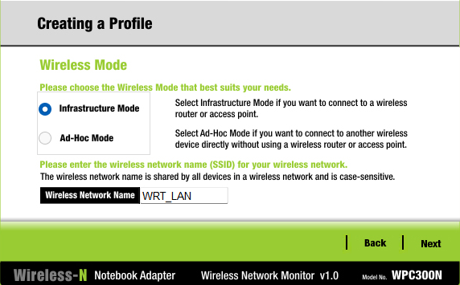
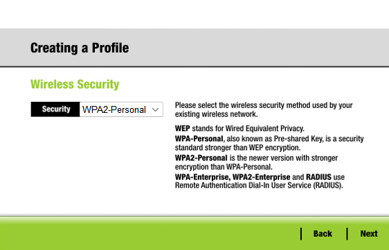
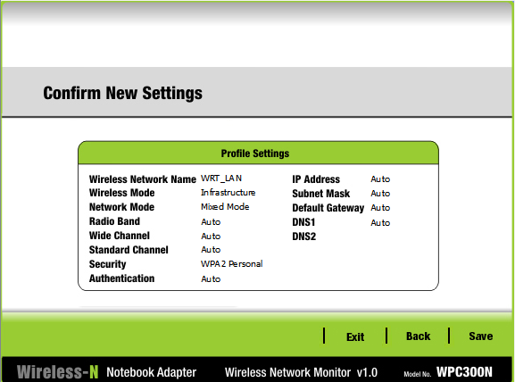
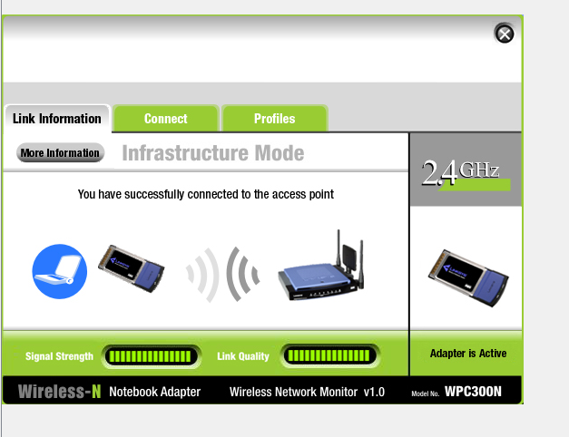
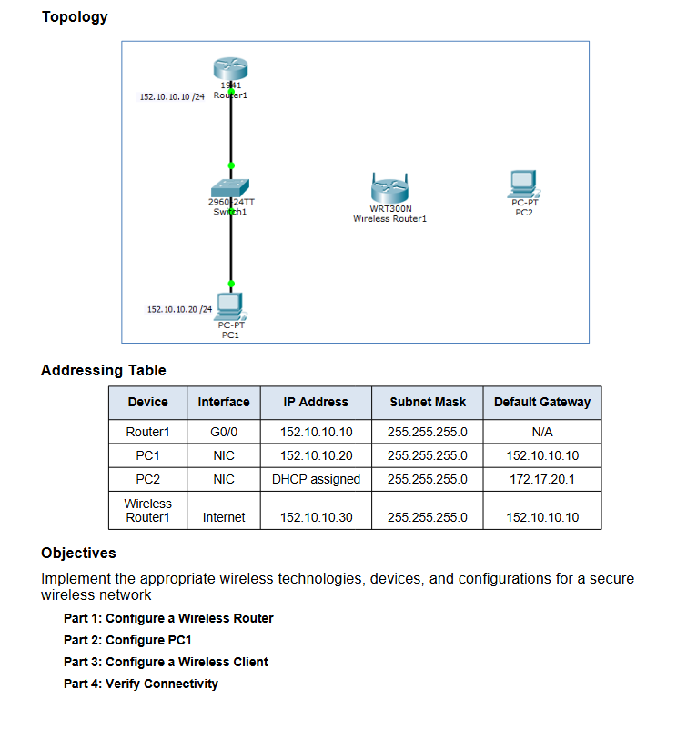
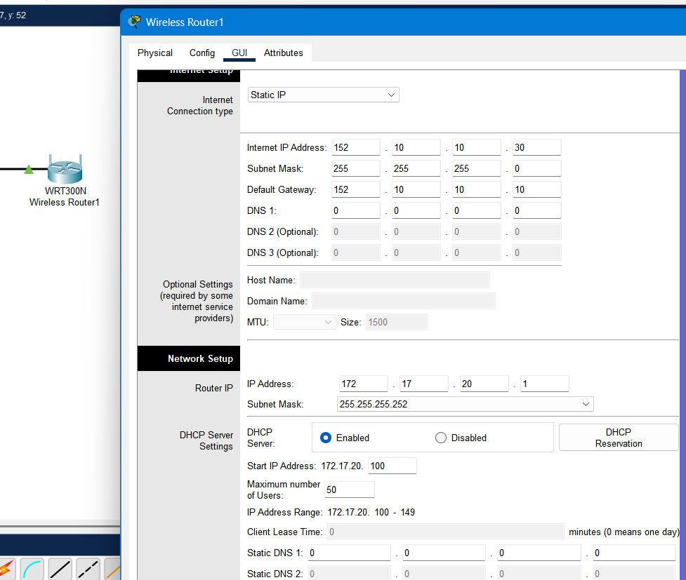
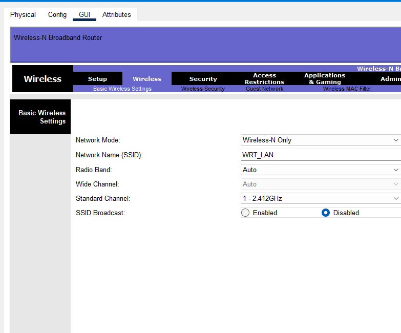
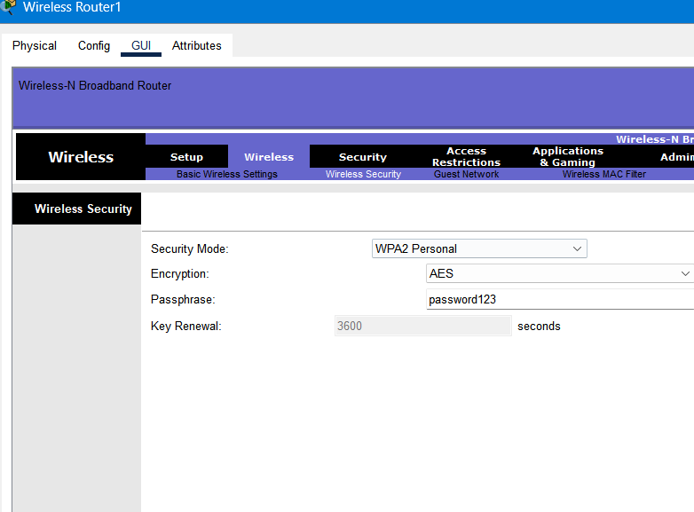

# 🛜 Network+ Learning Activity #19 — Configuring a Secure Wireless LAN (Cisco Packet Tracer)

This lab demonstrates how to set up and secure a wireless LAN using a Linksys WRT300N wireless router in Cisco Packet Tracer. The configuration includes setting up WAN and LAN addressing, enabling DHCP, securing Wi-Fi with WPA2-Personal, disabling SSID broadcast, and connecting a wireless client manually.

---

## 📡 Topology & Addressing

### Topology


### Addressing Table
| Device           | Interface | IP Address     | Subnet Mask     | Default Gateway |
|------------------|-----------|----------------|-----------------|-----------------|
| **Router1**      | G0/0      | 152.10.10.10   | 255.255.255.0   | N/A             |
| **PC1**          | NIC       | 152.10.10.20   | 255.255.255.0   | 152.10.10.10    |
| **PC2**          | NIC       | DHCP assigned  | 255.255.255.0   | 172.17.20.1     |
| **Wireless Rtr1**| Internet  | 152.10.10.30   | 255.255.255.0   | 152.10.10.10    |

---

## 🎯 Objectives
- Configure a wireless router for LAN/WAN access
- Enable DHCP for wireless clients
- Secure the wireless network with WPA2-Personal
- Disable SSID broadcast and manually connect a wireless client
- Verify connectivity from inside the WLAN

---

## 🛠️ Part 1 — Configure Wireless Router

### Step 1 — Internet (WAN) Settings
**What to do:**  
1. Open **Wireless Router1 → GUI → Setup**.  
2. Set **Internet Connection Type** to `Static IP`.  
3. Configure:
   - IP Address: `152.10.10.30`
   - Subnet Mask: `255.255.255.0`
   - Default Gateway: `152.10.10.10`
4. Leave DNS values at default or `0.0.0.0`.  
5. Save settings.  


**Why:**  
The wireless router’s Internet (WAN) port needs a static IP to communicate with the main Router1. Without this, devices inside the WLAN can’t reach other networks.

---

### Step 2 — LAN Settings & DHCP
**What to do:**  
1. Under **Network Setup**, set:
   - IP Address: `172.17.20.1`
   - Subnet Mask: `255.255.255.0`
2. **Enable DHCP Server** with range:
   - Start IP: `172.17.20.100`
   - Max Users: `50`
3. Save settings.

**Why:**  
This IP is the *default gateway* for all wireless clients. DHCP auto-assigns addresses to clients, preventing manual IP mistakes.

---

### Step 3 — Wireless Basic Settings
**What to do:**  
1. Go to **Wireless → Basic Wireless Settings**.  
2. Configure:
   - Network Mode: `Wireless-N Only`
   - SSID: `WRT_LAN`
   - SSID Broadcast: **Disabled**
3. Save settings.  


**Why:**  
*Wireless-N Only* gives better throughput on compatible devices. Disabling SSID broadcast hides the network from casual scans (clients must be configured manually).

---

### Step 4 — Wireless Security
**What to do:**  
1. Go to **Wireless → Wireless Security**.  
2. Set:
   - Security Mode: `WPA2-Personal`
   - Encryption: `AES`
   - Passphrase: `password123`
3. Save settings.  


**Why:**  
WPA2-Personal with AES is the recommended secure option for small networks.

---

## 🖥️ Part 2 — Configure PC1 (Wired Host)
**What to do:**  
1. Open `PC1 → Desktop → IP Configuration`.  
2. Set:
   - IP Address: `152.10.10.20`
   - Subnet Mask: `255.255.255.0`
   - Default Gateway: `152.10.10.10`

**Why:**  
Static IP on the 152.10.10.0/24 network allows testing reachability from the WLAN.

---

## 📶 Part 3 — Configure PC2 (Wireless Client with Hidden SSID)
**What to do:**  
1. Open `PC2 → Desktop → PC Wireless → Advanced Setup`.
2. Set **Wireless Mode** to `Infrastructure` and enter **SSID**: `WRT_LAN`.  

3. Choose **WPA2-Personal**.  

4. Enter `password123`.  
5. Save the profile and connect.  

6. Verify **Signal Strength** and **Link Quality**.  


**Why:**  
Hidden SSID requires manual entry. *Infrastructure* mode ensures the client connects through the router, not peer-to-peer.

---

## 🔍 Part 4 — Verify Connectivity
**What to do:**  
From **PC2**:
```bash
ping 152.10.10.20
