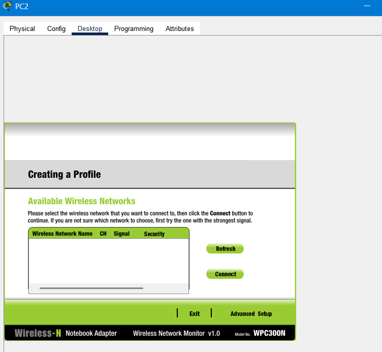
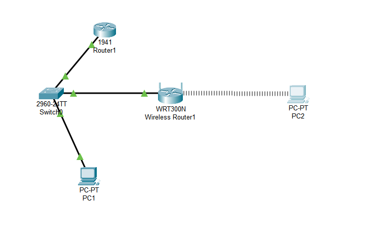
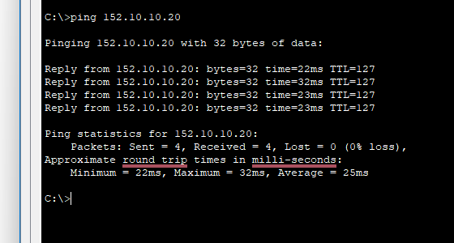

## Network+ Learning Activity #19 — Secure Wireless LAN (Cisco Packet Tracer)

## Lab Description
This lab demonstrates how to configure and secure a wireless LAN in Cisco Packet Tracer using a Linksys WRT300N wireless router. The setup involves connecting the router to an existing wired network, assigning WAN and LAN IP addresses, enabling DHCP for wireless clients, securing the wireless network using WPA2-Personal with AES encryption, hiding the SSID, manually connecting a wireless client, and verifying connectivity between wired and wireless devices.

---

## Topology & Addressing

### Topology

---

## Objectives
- Configure WAN and LAN on the wireless router  
- Enable DHCP for the WLAN  
- Set up Wi-Fi: SSID WRT_LAN, SSID Broadcast: Disabled, WPA2-Personal (AES)  
- Manually join a wireless client to the hidden SSID  
- Verify PC2 → PC1 connectivity

---

## Part 1 — Wireless Router Configuration

### 1) WAN (Internet) Settings
The WAN (Internet) port of the wireless router must be on the same network as the main router so it can send and receive traffic outside the WLAN.
- GUI → Setup
- Internet Connection Type: Static IP  
  - IP 152.10.10.30
  - Mask 255.255.255.0
  - Default Gateway 152.10.10.10
- Save.
  

### 2) LAN & DHCP
The LAN IP defines the network that wireless clients will join. DHCP automatically assigns IP addresses so users don’t have to configure them manually.
- Network Setup
  - Router IP: 172.17.20.1
  - Subnet Mask: 255.255.255.0
  - DHCP Server: Enabled  
    - Start IP 172.17.20.100  
    - Max Users 50
- Save.

### 3) Basic Wireless Settings
Here, we set the wireless mode, network name, and disable broadcasting so the network isn’t visible to casual scans.
- Wireless → Basic Wireless Settings
  - Network Mode: Wireless-N Only
  - SSID: WRT_LAN
  - SSID Broadcast: Disabled
- Save.

### 4) Wireless Security
To prevent unauthorized access, we configure WPA2-Personal with AES encryption and a passphrase.
- Wireless → Wireless Security
  - Security Mode: WPA2-Personal
  - Encryption: AES
  - Passphrase: password123
- Save.

---

## Part 2 — PC1 (Wired Host)
Confirm the addressing on PC1
- PC1 → Desktop → IP Configuration
  - IP 152.10.10.20
  - Mask 255.255.255.0
  - Gateway 152.10.10.10

This should be exactly the same as the given table at the top

---

## Part 3 — PC2 (Wireless Client, Hidden SSID)

Since SSID broadcast is disabled, we must manually create a connection profile.

1) PC2 → Desktop → PC Wireless  
   On Available Wireless Networks, click Advanced Setup.

  

3) Creating a Profile
   - Wireless Mode: Infrastructure  
   - Wireless Network Name (SSID): WRT_LAN  
   - Next.

  

4) Security
   - WPA2-Personal → Next  
   - Passphrase: password123 → Next
   
   

5) Confirm & Save
   - Review profile → Save → Connect to Network

  

6) Connected Status
   - Verify Signal Strength and Link Quality are green.

  

---

## 🔍 Part 4 — Verify Connectivity (Inside → Outside)

### 1) Wireless Network Overview
After connecting to the wireless signal, you should see a connection from PC2 to the Router  

### 2) Ping Test
To verify connectivity, we will ping PC2 from PC1

## Summary
This lab configured a secure wireless LAN in Cisco Packet Tracer by setting up WAN and LAN IPs, enabling DHCP, applying WPA2-Personal security, and disabling SSID broadcast. A wired PC and a manually configured wireless client were connected, and successful pings confirmed proper setup and connectivity.
